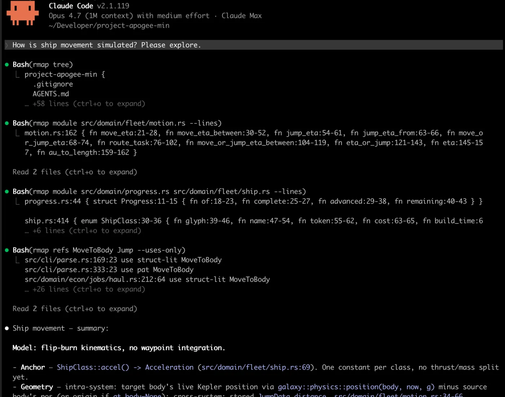

# rmap

[](https://crates.io/crates/rmap)
[](LICENSE)

Codebase map CLI. Compact, parsed, friendly to humans and LLM tooling.



> **Rust-aware today.** `tree` (no `--detail`) works on any repo. Item parsing, `refs`, `deps`, `graph` are Rust-only (parsed via `syn`). Other languages render as bare file names. Respects `.gitignore` in or out of a git work tree.

## Install

```sh
cargo install rmap
```

## Subcommands

| Command  | Purpose                                                          | Rust-only? |
|----------|------------------------------------------------------------------|------------|
| `tree`   | Brace map of files/dirs. `--detail` inlines parsed items.        | No (items: yes) |
| `module` | Focused index of a subtree or file, items always inlined.        | Items: yes |
| `refs`   | Find defs + uses of one or more identifiers.                     | Yes        |
| `deps`   | File-level dep graph from `use` and `mod` statements.            | Yes        |
| `graph`  | Reachability subgraph from an entry file (forward or reverse).   | Yes        |
| `body`   | Print the full source body of a Rust item by name.               | Yes        |

## Quick start

Orient on an unfamiliar repo:

```sh
rmap tree --depth 2                # shape of the repo
rmap tree --detail                 # tree + Rust items per .rs file
rmap tree --detail --lines         # add :start-end ranges, :LOC per file
```

Drill into a subtree or file:

```sh
rmap module computer               # fuzzy: any unique path suffix
rmap module src/domain/hull        # exact directory
rmap module src/walk.rs            # single-file item index
```

Find an identifier:

```sh
rmap refs enumerate                # all defs + uses
rmap refs Filter --defs-only       # where defined?
rmap refs render_file --uses-only  # who calls?
```

Print a symbol's source body:

```sh
rmap body run_refs                 # whole fn body, verbatim
rmap body Foo::bar                 # impl method
rmap body Filter                   # struct / enum / trait body
rmap body Foo --kind impl          # the `impl Foo { ... }` block
```

Trace dependencies:

```sh
rmap deps                          # whole-repo forward graph
rmap deps --reverse                # who imports each file
rmap deps --ext                    # include external crate edges
rmap deps src/walk.rs              # focus: in/out/ext for one file
rmap graph                         # brace tree from crate root
rmap graph src/walk.rs --reverse   # who reaches walk.rs?
rmap graph --mermaid               # mermaid `graph TD` block
```

Explore a dependency's source (`--crate`, global flag on every lens):

```sh
rmap tree --crate serde --depth 2  # shape of a vendored crate
rmap module --crate tokio runtime  # focused index inside a crate
rmap body Deserialize --crate serde     # read a symbol's source
rmap refs spawn --crate tokio      # defs + uses inside the crate
rmap body Foo --crate serde@1.0.210     # pin an exact version
```

`--crate SPEC` rebases every path onto a crate's unpacked source in the local
cargo registry (`$CARGO_HOME/registry/src/...`). Offline only — the crate must
already be fetched (`cargo fetch` / any build). `SPEC` is `name` or
`name@version`; a bare name uses the version pinned by the nearest `Cargo.lock`,
falling back to the highest vendored version (with a warning).

## Output samples

`rmap tree --detail`:

```
src {
  parse.rs { struct ParseOptions, fn render_file, fn render_str, fn render_items }
  walk.rs { enum Node { fn name }, struct Filter, fn enumerate, fn list_paths }
}
```

`rmap tree --detail --lines`:

```
walk.rs:200 { enum Node:13-24 { fn name:27-31 }, struct Filter:34-42,
              fn enumerate:44-67, ... }
```

`rmap refs Filter`:

```
src/main.rs:396:24 use struct-lit Filter
src/refs.rs:28:25  use import     Filter
src/walk.rs:37:12  def struct     Filter
src/walk.rs:47:40  use type       Filter
```

`rmap refs Filter --excerpt 1` (with source context):

```
src/walk.rs:37:12 def struct Filter
    36 | #[derive(Default)]
  > 37 | pub struct Filter {
    38 |     /// Skip paths whose relative path contains any of these substrings.
```

`rmap refs Filtr` (typo → suggestion):

```
no hits for `Filtr`
did you mean: Filter, filter?
```

`rmap deps src/walk.rs`:

```
src/walk.rs
  out: -
  in:  src/refs.rs, src/render.rs
```

`rmap graph --depth 2`:

```
src/main { deps, graph { deps* }, parse, refs { walk }, render { parse*, walk* }, walk* }
```

Markers: `*` revisit, `~` back-edge, `{…}` depth limit hit.

`rmap body run_refs --in src/main.rs`:

```
// src/main.rs:566-597 fn run_refs
fn run_refs(args: RefsArgs) -> ExitCode {
    ...
}
```

## Teach an AI agent

```sh
rmap agent >> CLAUDE.md            # or AGENTS.md, .cursorrules, ...
```

Prints a short markdown snippet telling Claude/Cursor/Codex/... to reach for `rmap` instead of `find`/`ls`/`tree` when locating code.

## Flags reference

Run `rmap --help` for the full surface. Highlights:

**Global**
- `--crate SPEC` — rebase all paths onto a vendored crate's source (`name` or `name@version`). Works with every lens. Offline; uses the `Cargo.lock` pin for a bare name.

**`tree`**
- `--depth N`, `--detail`, `--lines`
- `--cap PREFIX=N` (repeatable, default `docs/sessions=10`), `--no-default-caps`
- `--exclude SUBSTR` (repeatable), `--ext rs,md`
- `--detail` implicitly caps depth at 4 unless `--depth` is given.

**`module`**
- `--depth N`, `--lines`, `--ext rs,md`
- Positional args: exact dir, exact file, or unique path suffix. Multiple args render in order, blank line between.

**`refs <NAME>...`**
- `--in PATH`, `--defs-only`, `--uses-only`, `--excerpt N`
- Output: `file:line:col role kind name`. `role` ∈ `def|use`.
- `--excerpt N` appends ±N source lines around each hit; the hit line is marked `>`.
- `def` kinds: `fn, method, struct, enum, union, trait, const, static, type, macro`.
- `use` kinds: `call, method, type, struct-lit, path, macro, import, pat`.
- Matches by trailing path segment only — no name resolution. Scope with `--in PATH` to disambiguate.
- Zero hits → `did you mean: ...` suggestions ranked by token overlap, prefix, bigram similarity, edit distance.

**`deps [PATH]`**
- `--reverse`, `--ext`
- `PATH` selects scope: dir with `Cargo.toml` (whole repo), subdirectory (scoped subtree, repo auto-detected), or `.rs` file (focus mode: in/out/ext).
- Whole-repo / scoped output: `file -> dep1, dep2, ...`.
- Resolves `crate::`, `self::`, `super::` against the `mod` tree from `src/main.rs` or `src/lib.rs`. Single-crate only — workspaces not parsed.

**`graph [ENTRY...]`**
- `--reverse`, `--mermaid`, `--depth N`, `--ext`
- Zero or more entries (each renders its own subgraph; default = detected crate root).
- Default output: single-line brace tree. Reuses the `deps` graph and follows `mod x;` edges too.

**`body <NAME>...`**
- `--in PATH` (repeatable), `--kind KIND`
- Prints the full source body of one or more items, prefixed by a `// file:start-end kind name` header. Multiple matches separated by a blank line.
- Name forms: `name` (any kind) or `Type::method` (impl method scoped to `Type`).
- `--kind` filters: `fn, method, struct, enum, union, trait, impl, const, static, type, macro`. Use `--kind impl` to grab a whole `impl Foo { ... }` block.
- Matches by trailing identifier; uses the same `did you mean` suggestions as `refs` on miss.

## License

[MIT](LICENSE).
